# DOSW_BITACORA
Bitacora clase Desarrollo y Operaciones orientado por Software

## Semana 1 - Streams Basicos

### Ejercicio 1: Números pares mayores a diez
Se utiliza el método filter para evaluar que cada número sea divisible entre dos y strictly mayor a diez. Finalmente, el flujo resultante se recopila en una lista inmutable mediante el método toList.

### Ejercicio 2: Cantidad de palabras con más de 4 caracteres
Se filtran las palabras cuya longitud es superior a cuatro caracteres con filter, luego se transforman a mayúsculas con map y se ordenan alfabéticamente mediante sorted. Por último, se obtiene la cantidad total de palabras resultantes empleando la operación terminal count.

### Ejercicio 3: Obtener nombres de los usuarios
Se aplica filter para conservar únicamente los usuarios que cuentan con su estado activo en verdadero. A continuación, mediante map se extraen sus nombres convertidos a mayúsculas, se ordenan alfabéticamente con sorted y se almacenan en una lista final mediante toList.

### Ejercicio 4: Personas mayores de edad
Se utiliza filter para seleccionar los usuarios cuya edad es mayor o igual a 18 años. Posteriormente, se aplica map para extraer únicamente los nombres de las personas filtradas y se retorna la colección resultante en una lista con toList.

### Ejercicio 5: Transacciones bancarias
Se emplea peek para imprimir en consola cada transacción conforme es procesada en el flujo. Luego, con anyMatch se verifica si existe al menos una transacción que no haya sido aprobada, permitiendo validar el lote como verdadero únicamente cuando todas las transacciones son válidas.

## Semana 2 - Pokemon

### Ejercicio 1: Pokemon Tipo Fuego
Se utiliza filter para comprobar que el tipo de cada Pokemon coincida con Fuego, ignorando mayusculas y minusculas. Luego se extraen los nombres mediante map y se recopilan en una lista con toList.

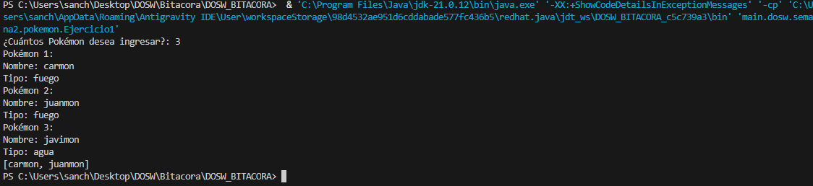

### Ejercicio 2: Pokedex Gritona
Se procesa el flujo de nombres aplicando la funcion map junto con toUpperCase para convertir cada elemento a mayusculas, entregando la lista de nombres transformada.

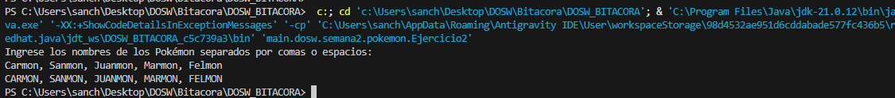

### Ejercicio 3: Poder Total del Equipo
Se utiliza el metodo reduce con un valor inicial de cero y el operador de suma para acumular y calcular el nivel total combinado de todos los Pokemon del equipo.

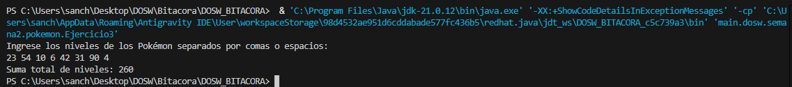

### Ejercicio 4: Pokemon Alfa
Se emplea la operacion terminal max junto con un comparador por el atributo nivel para encontrar el Pokemon que posee el nivel mas alto del equipo.

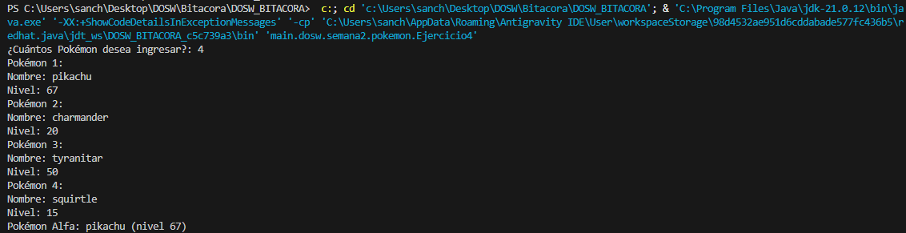

### Ejercicio 5: Pokemon Legendarios
Se aplica filter para conservar unicamente los Pokemon cuyo nivel sea estrictamente mayor a 80 y se utiliza count para contabilizar la cantidad total resultante.

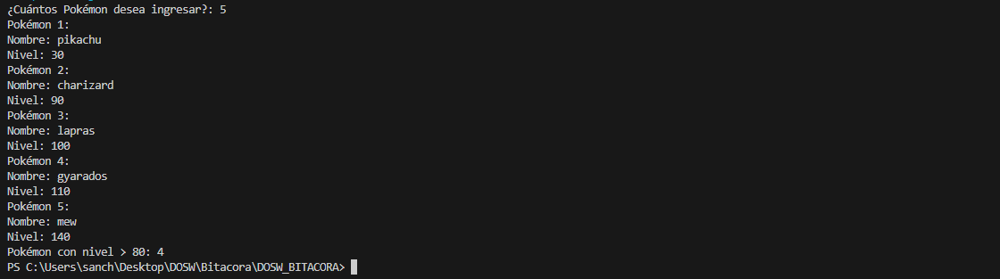

### Ejercicio 6: Pokedex Sin Duplicados
Se utiliza la operacion intermedia distinct sobre el flujo de nombres para eliminar elementos repetidos y conservar unicamente una ocurrencia de cada Pokemon.

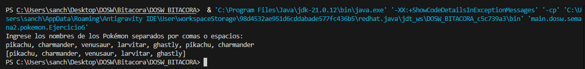

### Ejercicio 7: Orden del Profesor Oak
Se aplica el metodo sorted sobre la lista de nombres para ordenarlos alfabeticamente de manera natural antes de almacenarlos en la lista final.

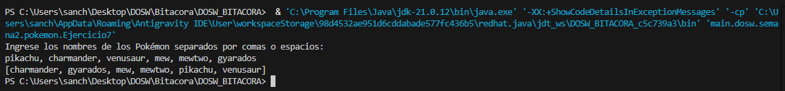

### Ejercicio 8: Evoluciones Preparadas
Se filtran los Pokemon cuyo atributo booleano indica que pueden evolucionar, se extraen sus nombres mediante map y se retornan en una lista final.

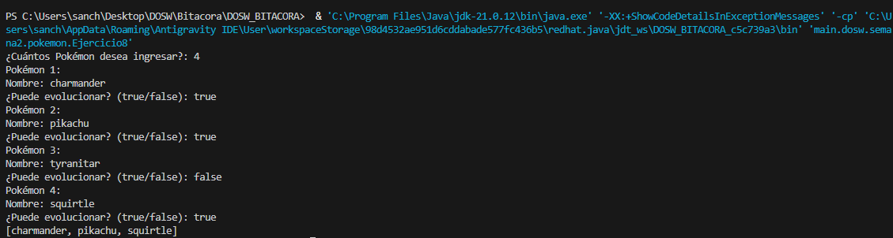

### Ejercicio 9: Equipo Elite
Se utiliza filter sobre la coleccion de objetos Pokemon para seleccionar exclusivamente aquellos cuyo poder de combate supera los 500 puntos.

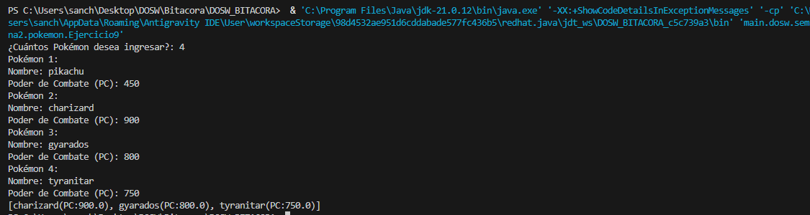

### Ejercicio 10: Pokedex Compacta
Se emplea map para transformar la lista de objetos Pokemon extrayendo unicamente el atributo nombre de cada uno y se recopila el resultado mediante collect.

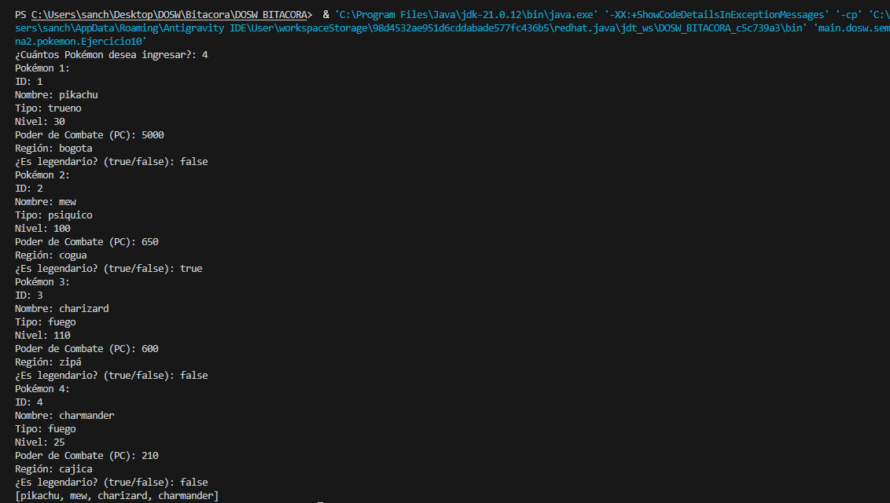

### Ejercicio 11: Poder Promedio
Se transforma el flujo de valores de poder de combate a tipos primitivos mediante mapToDouble y se calcula su media empleando la operacion terminal average.

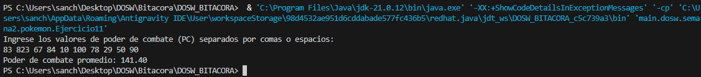

### Ejercicio 12: Campeon Regional
Se determina el Pokemon con mayor poder de combate del equipo utilizando la operacion terminal max junto con un comparador numerico por el atributo poderCombate.

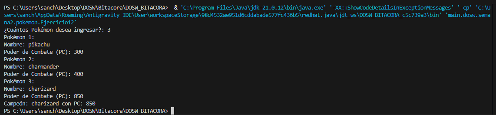

### Ejercicio 13: Organizar por Tipo
Se agrupan los Pokemon segun su tipo mediante la operacion groupingBy y se recopilan exclusivamente los nombres pertenecientes a cada grupo.

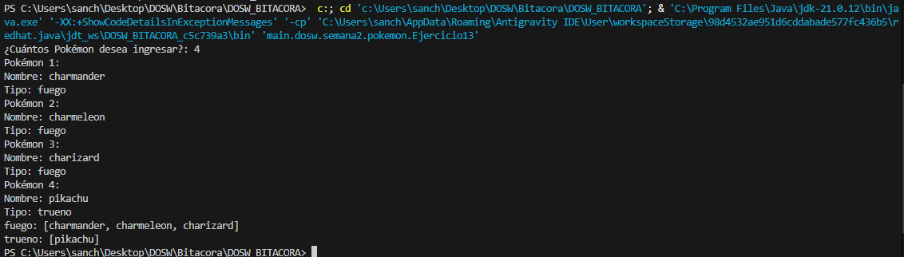

### Ejercicio 14: Organizar por Region
Se utiliza groupingBy para clasificar a los Pokemon de acuerdo con su region de procedencia, generando un mapa con los nombres correspondientes a cada region.

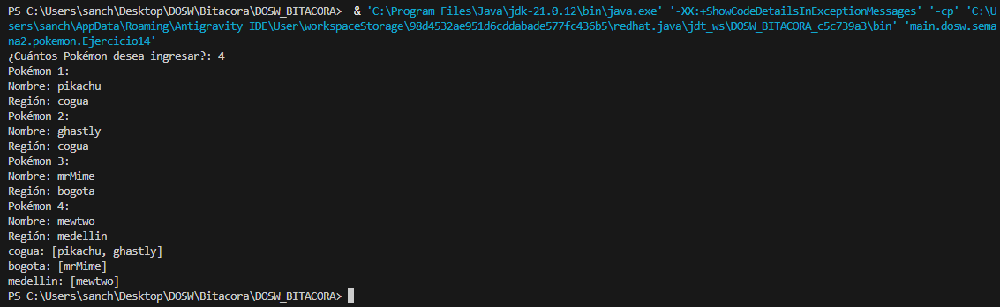

### Ejercicio 15: Maestro de Gimnasios
Se procesa el flujo de entrenadores aplicando la operacion terminal max junto con un comparador por el atributo medallas para encontrar al entrenador con mas medallas.

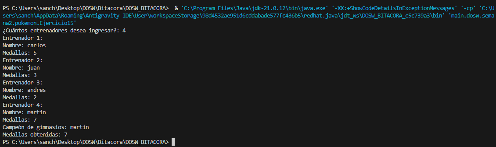

### Ejercicio 16: Entrenadores Experimentados
Se utiliza filter con referencia a metodo para evaluar la condicion de experiencia de cada entrenador y obtener unicamente a quienes cuentan con mas de cinco medallas.

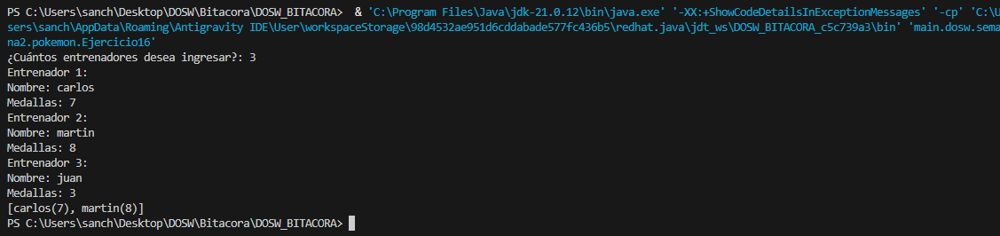

### Ejercicio 17: Equipo Mas Poderoso
Se calcula la suma total del poder de combate del equipo de cada entrenador mediante mapToDouble y sum, y luego se obtiene al entrenador con la mayor acumulacion aplicando la operacion terminal max.

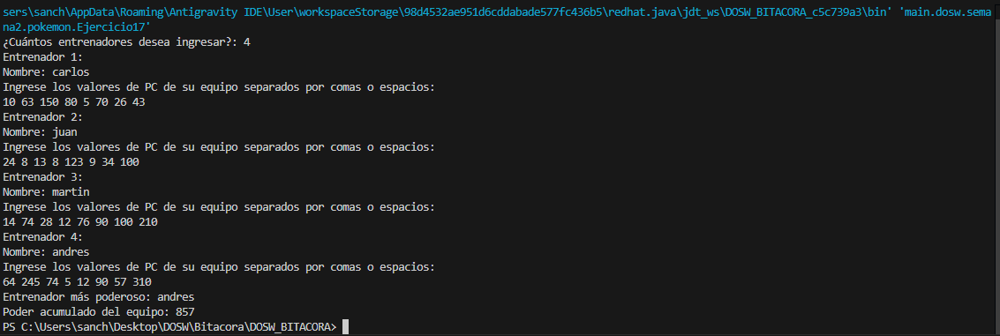

### Ejercicio 18: Top 5 Pokemon Mas Fuertes
Se ordenan los Pokemon de forma descendente de acuerdo con su poder de combate mediante sorted y se seleccionan unicamente los cinco primeros lugares con la operacion limit.

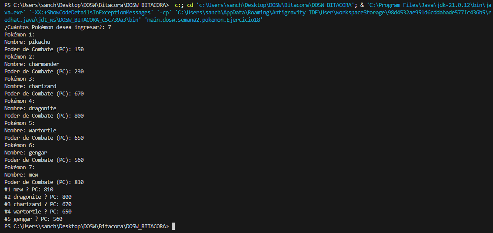

### Ejercicio 19: Top 3 Entrenadores
Se ordenan los entrenadores aplicando comparadores encadenados por medallas, poder acumulado y nombre, y se seleccionan los tres mejores mediante limit.

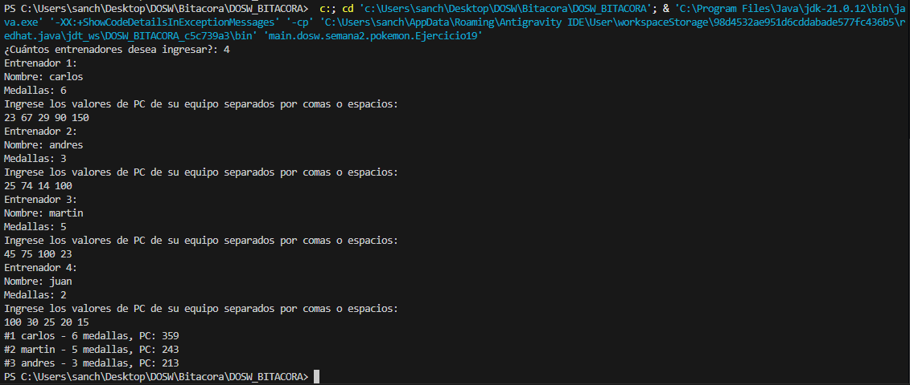

### Ejercicio 20: Pokedex Analitica
Se realizan multiples operaciones analiticas con streams para agrupar por tipo y region con groupingBy y counting, contabilizar legendarios con filter and count, calcular el promedio de nivel con mapToInt y average, y encontrar el Pokemon mas fuerte con max.

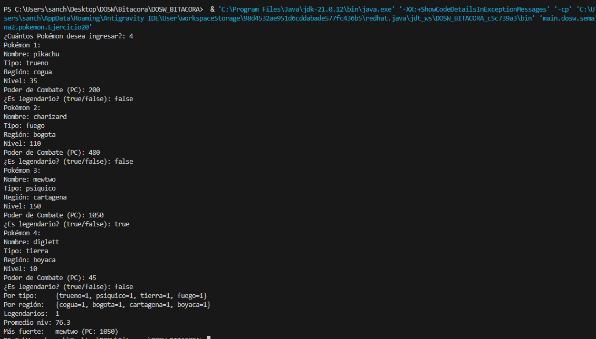

### Reto Mewtwo: Reporte de Poder Elite por Tipo
Propuesta: Se plantea un desafio para calcular el poder de combate acumulado de los Pokemon de alto nivel agrupados por su tipo elemental y organizados en un ranking de mayor a menor poder. Solucion: Se seleccionan los Pokemon con nivel mayor o igual a 50 mediante filter, se normaliza el tipo a mayusculas con map, se agrupan los poderes de combate por tipo elemental usando groupingBy, se calcula la suma acumulada de cada tipo mediante reduce y finalmente se ordenan los grupos en forma descendente con sorted.

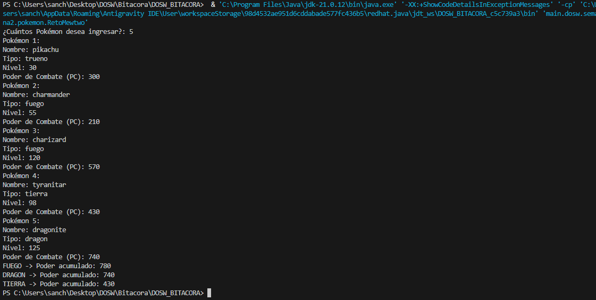

## Ejercicios que contienen Azucar Sintactico en lugar de lambdas

- Ejercicio 1: Pokemon::getNombre en la operacion map
- Ejercicio 2: String::toUpperCase en la operacion map
- Ejercicio 3: Integer::sum en la operacion reduce
- Ejercicio 4: Pokemon::getNivel en la operacion max con Comparator.comparingInt
- Ejercicio 8: Pokemon::isPuedeEvolucionar en la operacion filter y Pokemon::getNombre en la operacion map
- Ejercicio 10: Pokemon::getNombre en la operacion map
- Ejercicio 16: Entrenador::esExperimentado en la operacion filter
- Ejercicio 19: Entrenador::getMedallas, Entrenador::calcularPoderTotalEquipo y Entrenador::getNombre en el comparador encadenado de sorted

## Semana 3 - Patrones de Diseño

### Ejercicio 1: Procesador de pagos

Se implementa el patrón de diseño creacional Factory Method para desacoplar el procesamiento general de los pagos de las subclases concretas de cada pasarela. La interfaz Payment establece el contrato común (pay), mientras que clases como CreditCardPayment, PaypalPayment y BankTransferPayment definen la ejecución particular de cada pasarela. Por su parte, la clase abstracta PaymentProcessor orquesta la lógica del negocio mediante el método processPayment, delegando la instanciación directa del objeto a las subclases especializadas (CreditCardProcessor, PaypalProcessor y BankTransferProcessor) a través del método fábrica abstracto createPayment. Esto permite que el cliente en Main opere únicamente con las abstracciones, facilitando la adición de nuevos métodos de pago sin alterar el código existente.

### Ejercicio 2: Motor de videojuegos para consolas (Abstract Factory)

Se implementa el patrón de diseño creacional Abstract Factory para permitir que la clase GameEngine construya e interactúe con familias completas de componentes compatibles (Controller, Game y UI) sin acoplarse a implementaciones concretas de consolas específicas. La interfaz fábrica ConsoleFactory define los métodos de creación (createController, createGame y createUI), los cuales son implementados por las fábricas concretas PlayStationFactory y XboxFactory. Cada fábrica garantiza la creación de componentes de una misma familia (por ejemplo, PlayStationController, PlayStationGame y PlayStationUI). De esta forma, el motor de juego GameEngine recibe cualquier fábrica que implemente ConsoleFactory e inicia el sistema mediante el método run, logrando que la adición de nuevas plataformas (como Nintendo o PC) no afecte la lógica central del cliente.

### Ejercicio 3: Fábrica de muñecos (Builder)

Se implementa el patrón de diseño creacional Builder para separar el proceso de construcción paso a paso de un objeto complejo (ToyDoll) de su representación final. La interfaz ToyDollBuilder establece los pasos estándar del ensamblaje (buildHead, buildBody, buildArms, buildLegs y addAccessories). Las clases constructoras concretas ActionDollBuilder y ClassicDollBuilder implementan estos pasos asignando características específicas a cada tipo de muñeco. Por su parte, la clase constructora/directora ToyFactory controla la secuencia exacta de llamadas al builder recibido mediante el método constructDoll. Esto permite que el cliente en Main obtenga diferentes variantes de muñecos reutilizando el mismo algoritmo de ensamblaje.

### Ejercicio 4: Estación de servicio inteligente para vehículos (Adapter)

Se implementa el patrón de diseño estructural Adapter para permitir que la estación de servicio (SmartGasStation) interactúe de forma unificada con distintos tipos de cargadores eléctricos (FastElectricCharger y SlowElectricCharger) mediante la interfaz estándar FuelService. Dado que las interfaces de los cargadores eléctricos son incompatibles con el método supply(amount) de la gasolinera tradicional, las clases adaptadoras FastChargerAdapter y SlowChargerAdapter convierten la solicitud en litros a su equivalente en kWh (multiplicando los litros por 8.0 en el modelo rápido y por 7.0 en el modelo lento) y delegan la ejecución a los métodos específicos fastCharge y slowCharge. De esta manera, el sistema central funciona de forma transparente utilizando únicamente la interfaz objetivo.

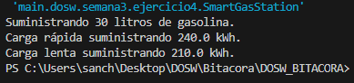

### Ejercicio 5: Figuras geométricas y colores (Bridge)

Se implementa el patrón de diseño estructural Bridge para desacoplar la abstracción de las formas geométricas (Forma) de la implementación de los colores (Color), evitando una explosión combinatoria de subclases por herencia múltiple. La clase abstracta Forma mantiene una referencia por composición hacia la interfaz Color. Las subclases de formas (Circulo y Cuadrado) delegan la obtención del color a las clases concretas de color (Rojo y Azul) mediante el método aplicarColor(). De esta forma, es posible agregar nuevas formas geométricas o nuevos colores de manera independiente sin modificar la jerarquía existente.

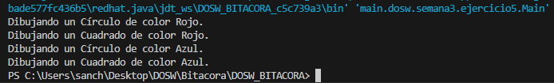

### Ejercicio 6: Inventario de bodega y cajas compuestas (Composite)

Se implementa el patrón de diseño estructural Composite para tratar de manera uniforme tanto a productos individuales (Product) como a contenedores o cajas compuestas (Box) que pueden incluir otros productos o cajas anidadas. La interfaz común Item define la operación getPrice(). La clase hoja Product retorna su precio individual, mientras que la clase compuesta Box mantiene una lista de elementos (List<Item>) y calcula su precio total de forma recursiva al recorrer todos sus ítems contenidos. Esto permite que el cliente WarehouseApp consulte el precio total de cualquier paquete o elemento sin necesidad de diferenciar si se trata de un objeto simple o una estructura compleja de cajas.

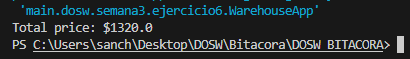

### Ejercicio 7: Simulador naval y módulos de barcos (Decorator)

Se implementa el patrón de diseño estructural Decorator para añadir capacidades dinámicas (ataque y defensa) y descripciones a un barco en tiempo de ejecución sin alterar su clase original ni recurrir a la creación masiva de subclases combinatorias. La interfaz Barco define los métodos principales (getDescripcion(), poderAtaque() y defensa()), implementados de forma base por la clase BarcoBase. La clase abstracta BarcoBaseDecorador actúa como envoltorio base manteniendo una referencia a un objeto de tipo Barco. Los decoradores concretos (BlindajeDecorador, RadarDecorador, MisilesDecorador y AntiTorpedosDecorador) extiende de dicho envoltorio y agregan sus bonificaciones correspondientes sobre las métricas del barco envuelto. Además, mediante la API de Streams y Lambdas de Java, la aplicación permite encadenar y aplicar dinámicamente cualquier lista de módulos de configuración sobre la embarcación.

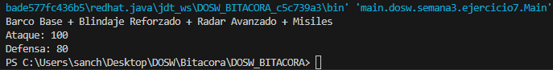

### Ejercicio 8: Controles migratorios de ingreso (Chain of Responsibility)

Se implementa el patrón de diseño de comportamiento Chain of Responsibility para procesar secuencialmente las verificaciones de ingreso a un país (pasaporte/visa, antecedentes, motivos del viaje y aprobación final). La interfaz ControlMigratorio y su clase abstracta base ControlMigratorioHandler establecen la estructura del manejador y el enlace al siguiente elemento de la cadena mediante setSiguiente(). Cada manejador concreto (PasaporteControl, AntecedentesControl, MotivoViajeControl y AprobacionFinalControl) evalúa la solicitud (IngresoRequest) y decide si aprueba el paso delegando la ejecución al siguiente eslabón mediante super.procesar(request), o si detiene el proceso inmediatamente en caso de rechazo, desacoplando completamente al solicitante de los controles individuales.

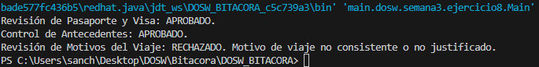

### Ejercicio 9: Acciones de personaje de videojuego (Command)

Se implementa el patrón de diseño de comportamiento Command para encapsular cada una de las acciones de un personaje de videojuego (caminar, saltar, atacar y defenderse) en objetos independientes que implementan la interfaz Command (`execute()`). El personaje `GameCharacter` actúa como receptor (Receiver) definiendo la lógica concreta de cada acción. Los comandos concretos (`WalkCommand`, `JumpCommand`, `AttackCommand` y `DefendCommand`) mantienen una referencia al personaje y delegan la ejecución correspondiente. Por su parte, la clase `GameController` actúa como invocador (Invoker) ejecutando el comando recibido mediante `pressButton(command)` sin conocer los detalles de implementación interna de la acción ni del personaje.

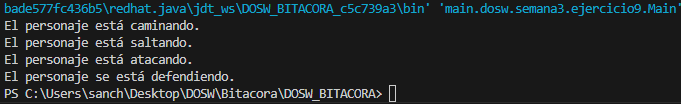

### Ejercicio 10: Recorrido turístico por Roma (Iterator)

Se implementa el patrón de diseño de comportamiento Iterator para permitir la secuenciación y exploración de los lugares emblemáticos de Roma (Colosseum, Roman Forum, Trevi Fountain, Pantheon y Spanish Steps) sin exponer la estructura de datos interna subyacente. La interfaz `Iterator<T>` declara los métodos `hasNext()` y `next()`, mientras que la interfaz `Aggregate<T>` define el método de fabricación `createIterator()`. La clase contenedora `TourRoute` almacena internamente un arreglo privado de objetos `Place` e implementa la interfaz de agregación instanciando un iterador privado (`RomeIterator`). De este modo, la clase cliente `Tourist` recorre la ruta turística mediante `exploreTour(route)` operando únicamente a través de la interfaz abstracta del iterador.

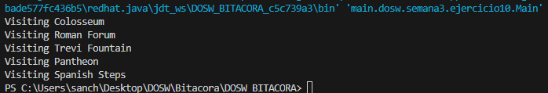

### Ejercicio 11: Aplicación de navegación y rutas (Strategy)

Se implementa el patrón de diseño de comportamiento Strategy para intercambiar dinámicamente los algoritmos de cálculo de ruta según la preferencia del usuario (más rápida, turística o más económica) sin modificar el código cliente de la aplicación. La interfaz `RouteStrategy` establece el contrato común mediante el método `calculateRoute()`. Las estrategias concretas (`FastestRoute`, `ScenicRoute` y `CheapestRoute`) encapsulan los algoritmos específicos de navegación. La clase contexto `NavigationApp` mantiene una referencia a la estrategia activa y permite cambiarla en tiempo de ejecución a través de `setRouteStrategy()`, ejecutando el cálculo correspondiente al invocar `startNavigation()`.

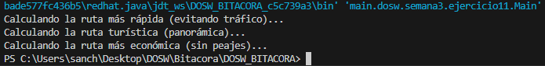

  
  
  
  
  
  
  
## Semana 4 - Taller 4: Combinacion de Patrones de Diseno

### Ejercicio 1: Plataforma de Pagos Inteligentes

Rol de cada patron:
- Strategy: Define una interfaz comun PaymentStrategy para todos los algoritmos de pago (Tarjeta, PSE, Nequi, PayPal, Stripe). Permite que la clase Checkout ejecute pagos sin conocer los detalles de implementacion de cada medio.
- Factory Method: Encapsula la logica de creacion de los objetos de pago segun el pais del usuario mediante la interfaz PaymentFactory y sus implementaciones concretas (ColombiaPaymentFactory y UsaPaymentFactory).

Interaccion entre los dos patrones:
El cliente selecciona el pais y el medio de pago. La fábrica correspondiente crea e instancia la estrategia de pago concreta requerida para ese pais. Luego, el objeto Checkout recibe dicha estrategia y llama a su metodo process(amount). De esta forma, Factory Method resuelve la responsabilidad de construir la estrategia correcta y Strategy resuelve la responsabilidad de ejecutar el pago.

Justificacion frente a una solucion sin patrones:
Sin patrones, la clase Checkout tendria multiples condicionales encadenados (if/switch) para verificar tanto el pais como el medio de pago, estando fuertemente acoplada a todas las clases concretas de pago. Agregar un nuevo pais o medio requerira modificar la clase Checkout directamente, violando el principio de Abierto/Cerrado (Open/Closed Principle). Al combinar Strategy y Factory Method, el sistema se vuelve extensible: agregar un medio de pago solo requiere crear una nueva estrategia o fabrica sin modificar Checkout ni la logica de otros pagos.

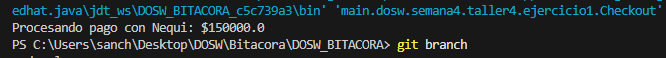

### Ejercicio 2: Sistema de Notificaciones Multicanal

Rol de cada patron:
- Observer: Desacopla la entidad Pedido (Subject) de los canales de envio (EmailNotifier, SmsNotifier, PushNotifier). Permite que los canales se suscriban o desuscriban dinamicamente sin alterar la clase Pedido.
- Factory Method: Encapsula la construccion y formateo del mensaje correspondiente a cada canal mediante la interfaz MessageFactory y sus implementaciones concretas (EmailMessageFactory genera HTML, SmsMessageFactory genera texto plano y PushMessageFactory genera JSON).

Interaccion entre los dos patrones:
Cuando el estado de un Pedido cambia, la clase Pedido notifica a todos los Observers suscritos pasando un objeto OrderEvent. Cada Observer invoca a su propia MessageFactory para construir el objeto Message especifico para su medio y procede a realizar la entrega. Observer gestiona el flujo de notificaciones y la suscripcion de canales, mientras que Factory Method gestiona la creacion del formato de mensaje adecuado.

Justificacion frente a una solucion sin patrones:
Sin patrones, la clase Pedido deberia conocer directamente cada canal de comunicacion y contener logica dispersa para formatear mensajes en HTML, texto o JSON segun el estado. Esto generaria un alto acoplamiento y violaria el principio de Responsabilidad Unica (Single Responsibility Principle). La combinacion de Observer y Factory Method asegura que agregar un nuevo canal o cambiar el formato de los mensajes no requiera modificar la clase Pedido ni los demas observadores.

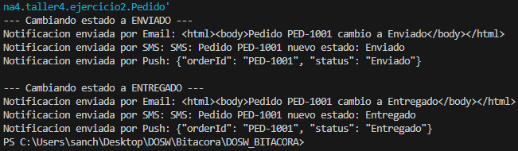

### Ejercicio 3: Sistema de Reportes Empresariales

Rol de cada patron:
- Template Method: Estructura la secuencia fija de pasos para la generacion de reportes en la clase base ReportGenerator mediante el metodo final generate(). Mantiene fijos los pasos de obtencion de datos y procesamiento, mientras delega el formato (applyFormat) y la exportacion (exportFile) a las subclases concretas.
- Factory Method: Desacopla la instanciacion de los reportes concretos a traves de ReportFactory, permitiendo construir instancias de PdfReport, ExcelReport o CsvReport segun el parametro solicitado por el usuario sin instanciar clases concretas directamente en el cliente.

Interaccion entre los dos patrones:
El cliente solicita un tipo de reporte a ReportFactory (por ejemplo, PDF). La fabrica construye e instancia la subclase adecuada (PdfReport). Posteriormente, el cliente invoca el metodo generate() en la instancia recibida. Template Method ejecuta en orden la secuencia fija de 4 pasos, llamando a la implementacion especifica de PdfReport para aplicar el formato y exportar el archivo.

Justificacion frente a una solucion sin patrones:
Sin patrones, el cliente deberia controlar mediante condicionales cual reporte instanciar y ademas duplicaria los pasos fijos (obtener datos y procesar informacion) en cada clase de reporte. Si el flujo general de generacion cambiara, habria que modificar múltiples clases. Con Template Method se centraliza el esqueleto del algoritmo eliminando duplicacion, y con Factory Method se desacopla la creacion del objeto concreto de la logica cliente.

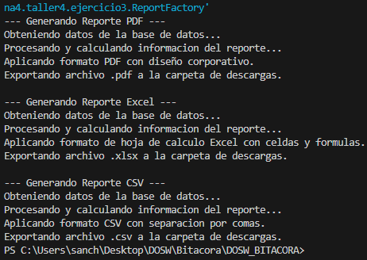

### Ejercicio 4: Plataforma de Videojuegos — Personajes

Rol de cada patron:
- Builder: Permite la construccion paso a paso de un personaje complejo al inicio del juego mediante la clase CharacterBuilder (configurando armadura, arma y habilidades). Evita la sobrecarga de constructores con multiples parametros y simplifica la creacion de personajes base.
- Decorator: Añade habilidades y efectos especiales de forma dinamica en tiempo de ejecucion (como ShieldDecorator, SpeedDecorator e InvisibilityDecorator) envolviendo al personaje base sin modificar su clase original.

Interaccion entre los dos patrones:
Al iniciar la partida, Builder construye la instancia base del personaje con todas sus propiedades iniciales. Durante la partida, a medida que el jugador activa efectos o mejoras temporales, los Decorators envuelven dinamicamente la instancia del personaje acumulando comportamientos sobre el metodo attack(). Al finalizar la bonificacion temporal, el envoltorio se remueve sin alterar el objeto base.

Justificacion frente a una solucion sin patrones:
Sin Builder, la creacion de personajes requeriria constructores masivos difíciles de mantener. Sin Decorator, se generaria una explosion combinatoria de subclases (por ejemplo, para 5 poderes combinables se necesitarian 32 subclases distintas). Al combinar Builder y Decorator, se mantiene la creacion limpia y se permite combinar poderes dinamicamente con solo 5 envoltorios y 1 clase base.

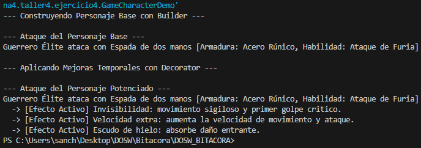

### Ejercicio 5: Integración con Sistema Bancario Antiguo

Rol de cada patron:
- Adapter: Adapta e integra la interfaz del servicio bancario antiguo (LegacyBankService) a la interfaz moderna PaymentProcessor mediante la clase LegacyBankAdapter. Traduce llamadas incompatibles, convirtiendo por ejemplo montos decimales a valores enteros en centavos y redirigiendo la ejecucion al metodo legacy correspondiente.
- Facade: Proporciona una interfaz simplificada (BankFacade) que encapsula y oculta la complejidad del flujo del banco antiguo (como la apertura de sockets, autenticacion, inicializacion de sesion y cierre de conexion).

Interaccion entre los dos patrones:
El desarrollador llama al metodo simplificado procesarPago(monto) expuesto por BankFacade. La clase Facade orquesta en orden todos los pasos de infraestructura requeridos por el banco antiguo y, al llegar al momento del pago, delega la transaccion a LegacyBankAdapter. El Adapter traduce la llamada al formato legacy (monto a centavos) y llama a LegacyBankService para realizar el cobro.

Justificacion frente a una solucion sin patrones:
Sin Adapter y Facade, los desarrolladores tendrian que conocer y replicar manualmente los 6 a 8 pasos de inicializacion tecnica cada vez que desearan realizar un pago. Ademas, el codigo cliente deberia lidiar directamente con metodos antiguos e incompatibles (como convertir manualmente decimales a centavos). Al combinar ambos patrones, Adapter resuelve la incompatibilidad de interfaces y Facade oculta la complejidad del proceso, logrando un codigo limpio, desacoplado y de facil mantenimiento.

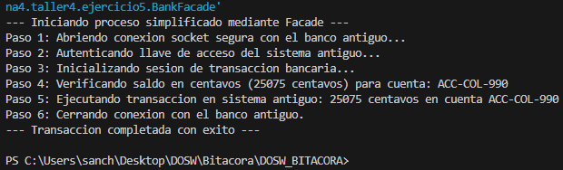

### Ejercicio 6: Motor de Recomendaciones

Rol de cada patron:
- Strategy: Encapsula los distintos algoritmos de recomendacion (GenreStrategy, HistoryStrategy, PopularityStrategy) bajo la interfaz comun RecommendationAlgorithm. Permite cambiar el criterio de recomendacion dinamicamente en tiempo de ejecucion sin reiniciar la aplicacion.
- Observer: Notifica automaticamente a todos los componentes interesados (HomePageComponent, NotificationService, SuggestedListComponent) cuando el perfil del usuario (Subject) actualiza sus preferencias o cambia de algoritmo.

Interaccion entre los dos patrones:
Cuando el usuario cambia sus preferencias de recomendacion, la clase UserProfile asigna la nueva estrategia (Strategy) e inmediatamente invoca notificarObservadores(). Cada observador (Observer) reacciona al evento obteniendo el nuevo listado de contenidos generado por el algoritmo activo para actualizar la interfaz grafica o enviar notificaciones en tiempo real sin necesidad de polling.

Justificacion frente a una solucion sin patrones:
Sin Strategy, el motor de recomendaciones requeriria condicionales acoplados para evaluar cada tipo de algoritmo. Sin Observer, la aplicacion tendria que consultar periodicamente (polling) o invocar manualmente cada componente de la interfaz para refrescar las recomendaciones. La combinacion de ambos patrones garantiza que cambiar la logica de recomendacion sea transparente y que la interfaz reaccione instantaneamente manteniendo el principio de desacoplamiento.

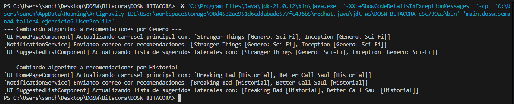

### Ejercicio 7: Flujo de Aprobación de Documentos

Rol de cada patron:
- Chain of Responsibility: Encadena secuencialmente los validadores del documento (AutorHandler, LiderHandler, JuridicoHandler). Cada manejador evalua el documento y decide si aprueba su paso o lo transfiere al siguiente eslabón de la cadena.
- State: Modela el ciclo de vida del documento mediante clases que representan sus estados (DraftState, InReviewState, ApprovedState, RejectedState). Encapsula las reglas y operaciones permitidas para cada transicion de estado, eliminando sentencias condicionales (switch/if) en el documento.

Interaccion entre los dos patrones:
A medida que el documento recorre la cadena de responsabilidad, cada manejador invoca los metodos approve() o reject() del objeto Document. La clase Document delega la transicion a su estado interno actual (State), el cual actualiza el estado del documento al siguiente nivel. De esta manera, Chain of Responsibility controla el flujo de revision por etapas y State controla la validez de las transiciones del documento.

Justificacion frente a una solucion sin patrones:
Sin Chain of Responsibility, el proceso de revision requeriria una clase monolitica llena de condicionales rigidos para ejecutar las validaciones en orden. Sin State, la clase Document contendria multiples sentencias switch para verificar qué operaciones estan permitidas en cada estado. La combinacion de ambos patrones asegura que sea muy sencillo agregar nuevas etapas de revision o nuevos estados sin modificar la logica existente.

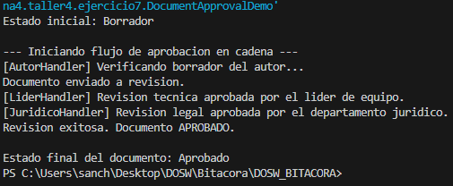

### Ejercicio 8: Sistema de Pedidos en Restaurante

Rol de cada patron:
- Builder: Permite construir el pedido paso a paso eligiendo tamaño, carne, toppings y acompañamientos. El metodo build() garantiza que el pedido este completo y valido antes de existir, evitando un constructor con multiples parametros dificil de mantener.
- Observer: Notifica automaticamente a los subsistemas (KitchenService, BillingService, DeliveryService) cuando el pedido se confirma. El Order no conoce directamente a ninguno de ellos; simplemente llama confirm() y cada observer reacciona de forma independiente.

Interaccion entre los dos patrones:
El Builder construye el Order y registra los observers antes de llamar build(), de modo que el objeto resultante es completamente inmutable. Al invocar order.confirm(), el Order recorre su lista de observers y notifica a cada uno. Builder actua en el momento de la construccion y Observer actua en el momento de la confirmacion, cubriendo dos etapas distintas del ciclo de vida del pedido sin que ninguna de las dos se interfiera.

Justificacion frente a una solucion sin patrones:
Sin Builder, crear un pedido personalizado requeriria un constructor con todos los ingredientes como parametros, lo que hace el codigo fragil y dificil de leer. Sin Observer, el pedido tendria que conocer y llamar directamente a cocina, facturacion y domicilios, generando acoplamiento fuerte. Si se agrega un nuevo subsistema habria que modificar el Order. Con ambos patrones, agregar un ingrediente o un nuevo servicio de notificacion no afecta el resto del sistema.

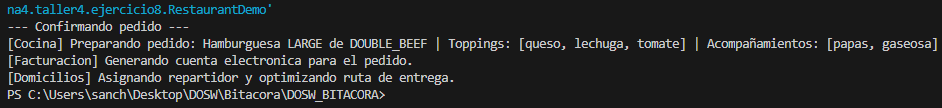

### Ejercicio 9: Sistema de Autenticación Empresarial

Rol de cada patron:
- Strategy: Encapsula los diferentes mecanismos de autenticacion (PasswordStrategy, GoogleStrategy, MicrosoftStrategy, TokenStrategy, BiometricStrategy) detras de una interfaz comun (AuthStrategy). El AuthService recibe la estrategia adecuada segun el tipo de usuario y delega la autenticacion sin saber como funciona internamente cada mecanismo.
- Chain of Responsibility: Encadena las validaciones post-autenticacion en secuencia (CredentialValidator → PermissionValidator → LocationValidator → TimeValidator). Cada validador decide si el acceso continua al siguiente o lo bloquea, sin que ningun validador conozca a los demas.

Interaccion entre los dos patrones:
Strategy actua primero: el AuthService selecciona el mecanismo correcto y autentica al usuario, produciendo un AuthResult. Ese resultado es el dato que recibe la cadena: Chain of Responsibility lo recorre de validador en validador y concede o deniega el acceso final. Los dos patrones cubren fases distintas del proceso: Strategy responde "quién eres" y Chain responde "si puedes entrar".

Justificacion frente a una solucion sin patrones:
Sin Strategy, el AuthService tendria un bloque de condicionales (if tipo == "google", if tipo == "biometrico"...) que crece cada vez que se agrega un metodo nuevo. Sin Chain of Responsibility, todas las validaciones estarian en un unico metodo lleno de condicionales anidados, dificil de extender o reordenar. Con ambos patrones, agregar un nuevo metodo de autenticacion o una nueva validacion solo requiere crear una clase nueva sin tocar el codigo existente.

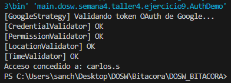

### Ejercicio 10: Aplicación de Edición de Imágenes

Rol de cada patron:
- Decorator: Aplica filtros de forma acumulativa sobre la imagen. GrayscaleDecorator, SepiaDecorator, BrightnessDecorator, ContrastDecorator y NoiseReductionDecorator envuelven la imagen uno sobre otro. La imagen base (BaseImage) nunca se modifica; cada filtro agrega una capa encima. Se pueden apilar en cualquier orden sin que los filtros existentes se alteren.
- Command: Encapsula cada operacion de filtro como un objeto con execute() y undo(). ApplyFilterCommand guarda el estado de la imagen antes de aplicar el Decorator, lo que permite revertir cualquier filtro de forma individual. El ImageEditor mantiene dos stacks: uno con los comandos ejecutados (para undo) y otro con los deshechos (para redo).

Interaccion entre los dos patrones:
Cuando el usuario aplica un filtro, el Command llama execute(), que envuelve la imagen actual con el Decorator correspondiente y apila el comando en el historial. Cuando el usuario hace undo, el Command restaura la referencia a la imagen previa al Decorator, quitando efectivamente esa capa. Decorator aporta la estructura de filtros apilados y Command aporta la capacidad de navegar ese historial hacia atras y hacia adelante.

Justificacion frente a una solucion sin patrones:
Sin Decorator, cada combinacion de filtros requeriria una subclase distinta o modificar directamente los pixeles de la imagen, generando una explosion de clases o perdida del estado original. Sin Command, implementar undo requeriria guardar copias completas de la imagen en cada paso, consumiendo mucha memoria, o limitarse a deshacer solo la ultima accion. La combinacion permite filtros acumulativos de bajo costo (solo referencias) y un historial de operaciones individual y eficiente.

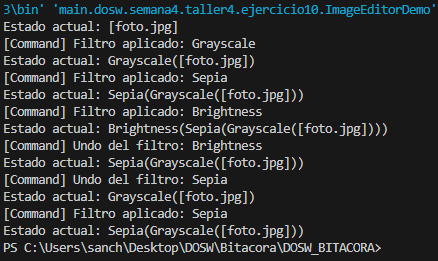

## Semana 4 - Ejercicios clase requisitos

### Ejercicio 1: Diagrama de Contexto TechCupFutbol

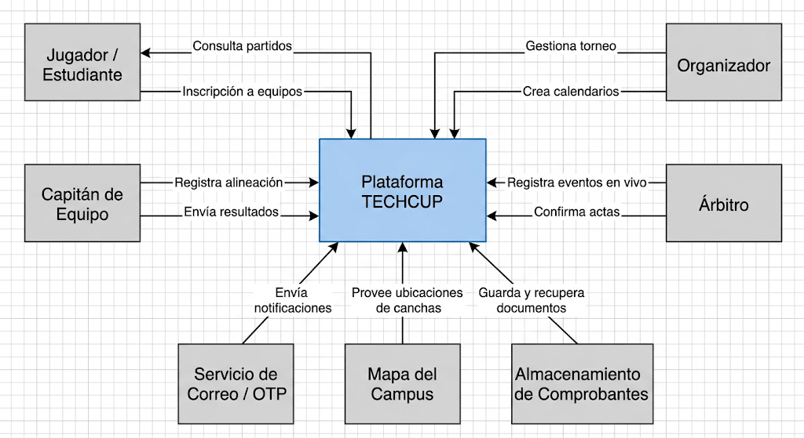

### Ejercicio 2: Requisitos del Sistema

#### Requisitos Funcionales

* Gestión de Identidad, Autenticación y Control de Acceso
  * Permitir el registro diferenciado de usuarios utilizando correos institucionales para estudiantes, profesores, administrativos y graduados, y correos Gmail para familiares y árbitros.
  * Autenticar usuarios mediante un código de un solo uso enviado al correo electrónico durante el registro, inicio de sesión inicial y acciones sensibles.
  * Gestionar el acceso mediante los roles de Jugador, Capitán, Árbitro y Organizador, garantizando que el organizador no pueda otorgar permisos de administrador.
  * Permitir la inactivación de usuarios únicamente si no pertenecen a un equipo vinculado a un torneo activo o en progreso.

* Gestión de Usuarios y Perfiles Deportivos
  * Permitir a los jugadores crear y actualizar su perfil deportivo especificando posición de juego, dorsal y foto.
  * Desplegar el número de dorsal sobre el color del equipo como avatar predeterminado cuando un jugador no suba una fotografía.
  * Habilitar el envío y recepción de solicitudes e invitaciones entre jugadores y capitanes para la conformación de equipos.
  * Restringir la modificación del dorsal o perfil deportivo cuando el jugador esté asignado a un equipo participando en un torneo activo o en progreso.

* Gestión de Equipos
  * Permitir al capitán crear equipos definiendo nombre, colores y escudo.
  * Validar que la plantilla cuente con un mínimo de 7 y un máximo de 12 jugadores.
  * Asegurar que un jugador pertenezca a un solo equipo y que los dorsales sean únicos dentro de la plantilla.
  * Validar que más del 50 por ciento de los integrantes del equipo pertenezcan a las carreras de Ingeniería de Sistemas, Inteligencia Artificial, Ciberseguridad o Ingeniería Estadística.
  * Ofrecer una vista de plantilla interactiva en formato de álbum de cromos para consultar la información y estadísticas de los jugadores.

* Gestión de Torneos y Calendarios
  * Permitir al organizador administrar el ciclo de vida del torneo con los estados Borrador, Activo, En progreso y Finalizado.
  * Adjuntar la reglamentación oficial en PDF y registrar las canchas con su ubicación física dentro del campus.
  * Permitir a los capitanes inscribir sus equipos mediante el envío del comprobante de pago para su posterior verificación por parte del organizador.
  * Visualizar un mapa interactivo del campus que muestre la ubicación de las canchas, los partidos programados y el estado del encuentro en tiempo real.
  * Generar de forma automática las llaves eliminatorias del torneo.
  * Mantener oculta la información detallada de las plantillas de los equipos inscritos hasta que el torneo cambie al estado En progreso.
  * Proporcionar acceso al historial completo de torneos finalizados para la consulta de estadísticas, alineaciones y resultados.

* Competencia y Alineaciones
  * Permitir al capitán organizar la alineación titular de 7 jugadores en el campo mediante la funcionalidad de arrastrar y soltar desde la banca.
  * Disponer de las formaciones tácticas 3-2-1, 2-3-1, 4-1-1 y 1-3-2.
  * Calcular y actualizar de forma automática la tabla de posiciones con partidos jugados, ganados, empatados, perdidos, goles a favor, goles en contra, diferencia de gol y puntos.

* Módulo de Arbitraje en Vivo
  * Proporcionar al árbitro herramientas para el control del tiempo como iniciar, pausar, reanudar, añadir tiempo extra y finalizar el encuentro.
  * Registrar eventos en tiempo real mediante botones de un solo toque para goles, tarjetas amarillas, tarjetas rojas y sustituciones con el minuto exacto.
  * Incorporar confirmaciones visuales, sonoras y vibración háptica en la interfaz táctil del árbitro.

* Gestión de Logística
  * Registrar y controlar la entrega de refrigerios a jugadores y equipos para evitar entregas duplicadas.
  * Administrar el inventario y trazabilidad de los materiales de dotación como petos, balones y kits.

* Estadísticas y Sanciones
  * Registrar métricas individuales y colectivas incluyendo goles, asistencias, faltas, tarjetas, minutos jugados y promedios por partido.
  * Publicar los rankings del torneo correspondientes al máximo goleador, tabla de juego limpio y máximos asistentes.
  * Aplicar reglas de sanción automática que suspendan para la siguiente fecha a los jugadores que acumulen tarjetas amarillas o reciban una tarjeta roja.
  * Generar y exportar reportes consolidados en formatos PDF y CSV para la administración del torneo.

* Servicio de Comunicaciones
  * Habilitar un chat grupal exclusivo para los miembros de cada equipo, creado automáticamente al conformar la plantilla.
  * Proveer un chat de soporte con un chatbot encargado de responder preguntas frecuentes sobre reglas, fechas y pagos, con opción de escalar al organizador.
  * Permitir el intercambio de mensajes directos e individuales entre jugadores.

#### Requisitos No Funcionales

* Arquitectura de Software
  * Estructurar el backend en microservicios desacoplados según los dominios funcionales definidos, coordinados a través de un API Gateway.
  * Desarrollar el backend utilizando Spring Boot, aplicando arquitectura por capas y patrones de diseño limpios.
  * Construir la interfaz de usuario web utilizando React y TypeScript.

* Gestión de Datos
  * Utilizar PostgreSQL para la persistencia de datos relacionales y transaccionales del sistema.
  * Emplear MongoDB para el almacenamiento de archivos e imágenes como fotos de perfil, escudos de equipos y comprobantes de pago.

* Accesibilidad e Inclusión
  * Cumplir con los lineamientos de accesibilidad WCAG 2.1 nivel AA.
  * Evitar el uso exclusivo del color para transmitir información, integrando íconos, textos y patrones para usuarios con daltonismo.
  * Asegurar un contraste mínimo de 4.5 a 1, navegación completa por teclado, foco visible y compatibilidad con lectores de pantalla.
  * Ofrecer alternativas visuales y vibración para todas las alertas sonoras generadas en el módulo de arbitraje.

* Seguridad y Auditoría
  * Almacenar las contraseñas cifradas en la base de datos y manejar la autorización de usuarios mediante tokens JWT.
  * Registrar logs de auditoría para eventos clave como autenticación, uso de códigos OTP, modificaciones en partidos y actualización de estadísticas.

* Entorno de Desarrollo y Gestión
  * Utilizar Maven para la gestión de dependencias y construcción del proyecto.
  * Administrar el código fuente en GitHub aplicando flujos de trabajo basados en ramas.
  * Implementar la metodología Scrum organizada en ciclos de un semana y gestionar las tareas a través de Jira.
