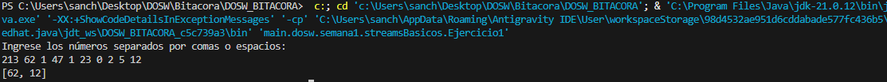
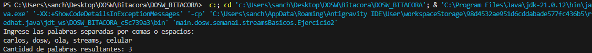
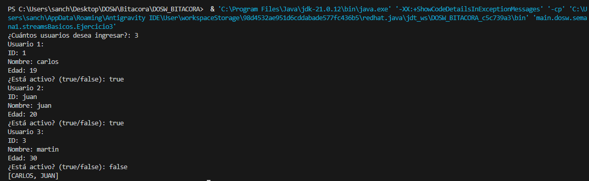
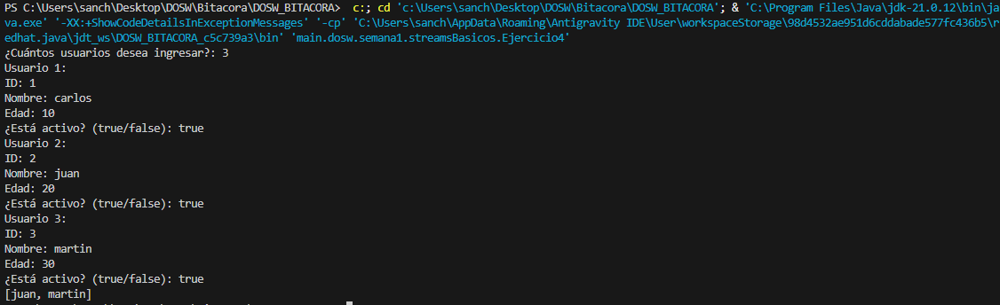
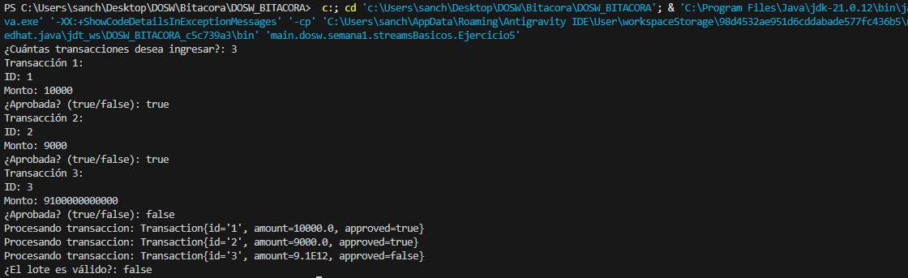
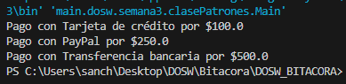
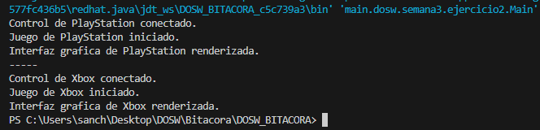
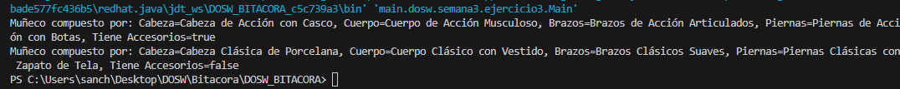

# DOSW_BITACORA
Bitacora clase Desarrollo y Operaciones orientado por Software

## Semana 1 - Streams Basicos

### Ejercicio 1: Números pares mayores a diez
Se utiliza el método filter para evaluar que cada número sea divisible entre dos y estrictamente mayor a diez. Finalmente, el flujo resultante se recopila en una lista inmutable mediante el método toList.

### Ejercicio 2: Cantidad de palabras con más de 4 caracteres
Se filtran las palabras cuya longitud es superior a cuatro caracteres con filter, luego se transforman a mayúsculas con map y se ordenan alfabéticamente mediante sorted. Por último, se obtiene la cantidad total de palabras resultantes empleando la operación terminal count.

### Ejercicio 3: Obtener nombres de los usuarios
Se aplica filter para conservar únicamente los usuarios que cuentan con su estado activo en verdadero. A continuación, mediante map se extraen sus nombres convertidos a mayúsculas, se ordenan alfabéticamente con sorted y se almacenan en una lista final mediante toList.

### Ejercicio 4: Personas mayores de edad
Se utiliza filter para seleccionar los usuarios cuya edad es mayor o igual a 18 años. Posteriormente, se aplica map para extraer únicamente los nombres de las personas filtradas y se retorna la colección resultante en una lista con toList.

### Ejercicio 5: Transacciones bancarias
Se emplea peek para imprimir en consola cada transacción conforme es procesada en el flujo. Luego, con anyMatch se verifica si existe al menos una transacción que no haya sido aprobada, permitiendo validar el lote como verdadero únicamente cuando todas las transacciones son válidas.

## Semana 3 - Patrones de Diseño

### Ejercicio 1: Procesador de pagos

Se implementa el patrón de diseño creacional Factory Method para desacoplar el procesamiento general de los pagos de las subclases concretas de cada pasarela. La interfaz Payment establece el contrato común (pay), mientras que clases como CreditCardPayment, PaypalPayment y BankTransferPayment definen la ejecución particular de cada pasarela. Por su parte, la clase abstracta PaymentProcessor orquesta la lógica del negocio mediante el método processPayment, delegando la instanciación directa del objeto a las subclases especializadas (CreditCardProcessor, PaypalProcessor y BankTransferProcessor) a través del método fábrica abstracto createPayment. Esto permite que el cliente en Main opere únicamente con las abstracciones, facilitando la adición de nuevos métodos de pago sin alterar el código existente.

### Ejercicio 2: Motor de videojuegos para consolas (Abstract Factory)

Se implementa el patrón de diseño creacional Abstract Factory para permitir que la clase GameEngine construya e interactúe con familias completas de componentes compatibles (Controller, Game y UI) sin acoplarse a implementaciones concretas de consolas específicas. La interfaz fábrica ConsoleFactory define los métodos de creación (createController, createGame y createUI), los cuales son implementados por las fábricas concretas PlayStationFactory y XboxFactory. Cada fábrica garantiza la creación de componentes de una misma familia (por ejemplo, PlayStationController, PlayStationGame y PlayStationUI). De esta forma, el motor de juego GameEngine recibe cualquier fábrica que implemente ConsoleFactory e inicia el sistema mediante el método run, logrando que la adición de nuevas plataformas (como Nintendo o PC) no afecte la lógica central del cliente.

### Ejercicio 3: Fábrica de muñecos (Builder)

Se implementa el patrón de diseño creacional Builder para separar el proceso de construcción paso a paso de un objeto complejo (ToyDoll) de su representación final. La interfaz ToyDollBuilder establece los pasos estándar del ensamblaje (buildHead, buildBody, buildArms, buildLegs y addAccessories). Las clases constructoras concretas ActionDollBuilder y ClassicDollBuilder implementan estos pasos asignando características específicas a cada tipo de muñeco. Por su parte, la clase constructora/directora ToyFactory controla la secuencia exacta de llamadas al builder recibido mediante el método constructDoll. Esto permite que el cliente en Main obtenga diferentes variantes de muñecos reutilizando el mismo algoritmo de ensamblaje.

